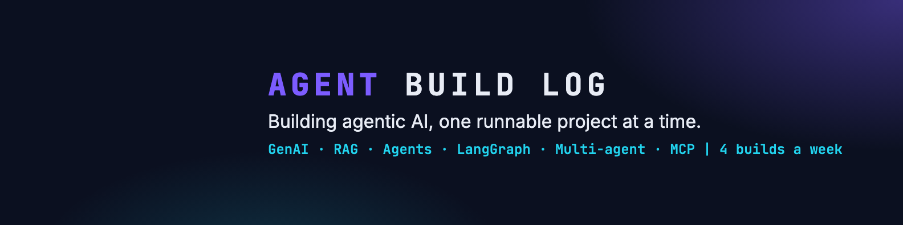

# Zero to Production Agents

**From "what does an LLM actually see?" to guarded, observable, production-ready AI agents, one runnable project at a time.**

The runnable code behind every post in *The Agent Build Log*, a LinkedIn series on Generative AI and Agentic AI (4 builds a week).
Every project comes with an `INTERVIEW.md`: tricky interview questions, the trap answer, the real answer backed by the run, and a follow-up. Each track also has an `INTERVIEW-PREP.md` that collects all of them.
The series runs in order, from LLM foundations to production multi-agent systems. Every project is self-contained: clone the repo, install `requirements.txt`, set your API key and run.

| # | Track | Projects |
|---|---|---|
| 01 | [GenAI & LLM Foundations](01-genai-llm-foundations/) | 8 projects |
| 02 | [Prompt Engineering](02-prompt-engineering/) | 8 projects |
| 03 | [RAG System](03-rag-systems/) | 8 projects |
| 04 | [AI Agents Foundations & First ReAct Agent](04-agent-foundations-react/) | 8 projects |
| 05 | [LangGraph Core Workflow Patterns](05-langgraph-workflow-patterns/) | 8 projects |
| 06 | [MultiAgent Architectures](06-multi-agent-architectures/) | 8 projects |
| 07 | [Multi-Framework Agent Development](07-multi-framework-agents/) | 8 projects |
| 08 | [Context Engineering & Agent Evaluations](08-context-engineering-evals/) | 8 projects |
| 09 | [Guardrails, Observability and MCP-A2A](09-guardrails-observability-mcp-a2a/) | 8 projects |

## Running a project
```sh
git clone https://github.com/ramesh247/zero-to-production-agents.git
cd zero-to-production-agents/<track>/<project>
python3 -m venv .venv && source .venv/bin/activate
pip install -r requirements.txt
cp .env.example .env   # add your ANTHROPIC_API_KEY
```

**Follow the build log on LinkedIn** for a new build four times a week: <your-linkedin-profile-url>

⭐ Star the repo if a build saved you time.
